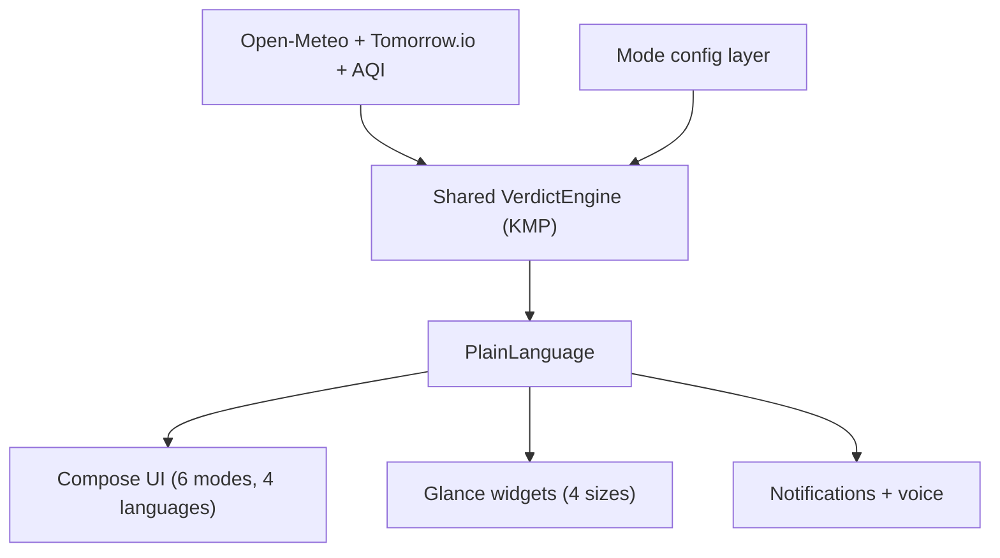

# 09 - Final App Vision (North Star)

> What the complete Kosmos Android product looks like when every version has shipped.
> Use this to keep the end goal in view while building one session at a time.

---

## The one-line promise

Apple Weather tells you it is 38 degrees. Kosmos tells you to take an umbrella for shade, drink 3L of water, step out for Vitamin D between 9:30 and 9:45, avoid the outdoors 11 AM-4 PM, and watch for mosquitoes after 6 PM. Same data, different output. The difference is interpretation.

Core promise: never show a number without telling the user what to do with it.

---

## The complete product

### Surfaces

- App: hero -> insights -> UPDATE nowcast -> hourly -> day timeline -> chat.
- Widgets: Small 1x1, Medium 2x1, Large 4x2, XL 4x4.
- Notifications: morning brief, rain alert, severe weather, lock-screen alert.
- Voice: read-aloud brief; voice questions.

### Six modes (one brain, many faces)

- Default - urban adult, 17 baseline verdicts.
- Family - child profiles, stricter AQI/UV, school brief.
- Employee - commute, lunch walk, screen breaks, gym window.
- Photographer - golden/blue hour, fog, stargazing, lightning.
- Elder - big text, high contrast, voice-first, top 3 cards.
- Farmer - crop catalog: spray, harvest, sowing, pest, monsoon.
- Travel - overlay that auto-activates > 100 km from home.

### Languages

English, Hindi, Telugu, Tamil at minimum - each with a localized personality, not literal translation.

### Free vs Kosmos+

- Free forever: all 17 verdicts, location, medium widget, morning brief, 5 chat/day.
- Kosmos+: unlimited chat, all modes, voice, multi-location, custom alerts, 10-day, confidence layer.

---

## Personas served at the end

- Ravi - "will it rain on my commute?" - Default + commute + rain alert.
- Sneha - "is it safe for my kids?" - Family mode.
- Krishnamurthy - "when to spray/harvest?" - Farmer mode.
- Aisha - "best weather city now?" - Travel overlay + where-to-go.
- Ramesh - "simple, big, in Telugu" - Elder mode + localization.

---

## Architecture at the end

- Shared KMP module is the brain (engine + models + clients) - reused with iOS.
- Compose for app, Glance for widgets, native platform APIs for location/notifications/billing.

---

## Success metrics (from PRD)

- Day-30 retention > 25%.
- A meaningful share of active users place the medium widget.
- Users act on verdicts (umbrella/walk/hydration) - measured qualitatively at launch, then via opt-in analytics.

---

## What stays true forever

- Deterministic verdicts from real numbers with documented thresholds - AI never invents a verdict.
- No ads, no selling data, verdicts never paywalled.
- Decision-first, warm, specific voice in every language.
