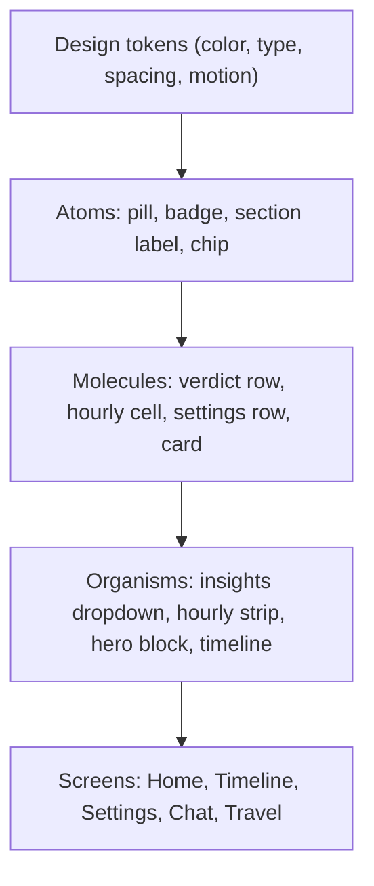

# 10 - Component Catalog + Component-First Build Order

> Every UI building block in Kosmos, grouped like a design system.
> This doc answers your idea: "list all components, build components first, then assemble layouts."

---

## Your idea - is it right?

Yes, mostly. Your instinct is exactly how design systems are built (atomic design: atoms -> molecules -> organisms -> screens). Building a shared component library first gives consistency, reuse, and a faster path to new screens. For a UI/product designer this is the natural way to think, and we will follow it.

One refinement so we do not over-build: we build components in **two passes**, not one giant pass.

- Pass 1 - Foundation + core components that almost every screen needs (design tokens, card, pill, section label, verdict row, hourly cell, character, background). Build these first, in isolation, with previews.
- Pass 2 - Screen-specific components built just-in-time when we assemble each screen (e.g. the travel filter chips only when we build the Travel screen).

Why not build 100% of components before any screen? Because a few components only reveal their real shape once they sit in a layout. Building every component fully blind risks rework. The hybrid (core library first, the rest as screens need them) is the professional middle path.

---

## Layer 0 - Design tokens (build first)

From [docs/06-Design-System.md](../06-Design-System.md). These are not visible components; they are the values every component uses.

- Colors: 18 condition gradient pairs, 22 verdict accent colors, 6 AQI badge colors, light + dark schemes.
- Typography: Inter font, hero temp (ultralight 64-88), condition word, section label (uppercase tracked), verdict title/detail, hourly cell.
- Spacing: 8pt grid; container paddings.
- Motion: durations + easings; Reduce Motion rules.
- Shape: card radius 14, pill full-round.

Files: `ui/theme/Color.kt`, `ui/theme/Type.kt`, `ui/theme/Theme.kt`, a new `ui/theme/Dimens.kt` and `ui/theme/Motion.kt`.

---

## Layer 1 - Atoms

- `KosmosCard` - rounded surface, white 85% over gradient, shadow. (replaces ad-hoc cards)
- `Pill` - generic rounded label.
- `AqiBadge` - colored dot + word, never a number. (exists, restyle)
- `SectionLabel` - uppercase tracked header. (exists inline, extract)
- `SuggestionChip` - chat suggestion / filter chip.
- `IconButton` (themed) - top-bar search/settings.
- `Fab` - "Ask Kosmos" and "Read aloud" buttons.
- `KplusBadge` - small "Kosmos+" tag for premium features.

---

## Layer 2 - Molecules

- `VerdictRow` - accent bar + emoji + title + detail. (exists as VerdictCard, refactor)
- `HourlyCell` - time + temp + condition emoji, "Now" emphasis. (inside HourlyStrip)
- `SettingsRow` - title + subtitle + control (toggle/switch).
- `ModeCard` - emoji + name + desc + phase tag (Settings mode picker).
- `CommuteChip` - multi-select transport (Bike/Bus/Car/Walk).
- `NowcastCard` - the UPDATE bulletin ("Rain likely in your area...").
- `TravelDestinationCard` - destination + why + temp (v2.1).
- `PlanCard` - Kosmos+ pricing tier (v2.0).
- `TimelineRow` - hour label + verdict block on a vertical line.

---

## Layer 3 - Organisms

- `HeroBlock` - character + temp + condition + feels-like + AQI + hi/lo.
- `CharacterView` - animated breathing character + condition accessory + Reduce Motion fallback. (exists, upgrade)
- `WeatherBackground` - condition gradient container. (exists, expand to 18)
- `InsightsDropdown` - single collapsible insights list. (exists, restyle)
- `HourlyStrip` - horizontal next-12-hours scroll. (exists, restyle)
- `DayTimeline` - vertical 5 AM-11 PM with verdict blocks.
- `ChatPanel` - message list + suggestions + input.
- `CitySearchSheet` - bottom-sheet city picker. (exists)
- `ModeGrid` - list of ModeCards (Settings).
- `TravelFilters` - vibe / audience / distance / region multi-selects (v2.1).
- `LockScreenAlert` - full-screen rain alert style (v1.1).

---

## Layer 4 - Screens (assembled from organisms)

- `HomeScreen` - hero -> insights -> UPDATE -> travel -> hourly -> today.
- `TimelineScreen` - DayTimeline.
- `SettingsScreen` - mode grid, commute, appearance (dark), units, widget, alerts, Kosmos+, customize.
- `ChatScreen / ChatSheet` - ChatPanel.
- `TravelScreen` - TravelFilters + destination list (v2.1).
- `WidgetPreviewScreen` - dev preview of widget sizes.

---

## Widgets (separate render system - Glance)

Glance cannot reuse Compose components, so widgets get their own small component set:

- `WidgetHeader` - city + temp + condition + AQI.
- `WidgetVerdictRow` - emoji + title.
- `WidgetHourlyRow` - compact hourly (large/XL only).
- Sizes: Medium 2x1 (done), Large 4x2 (v1.1), Small 1x1 (v1.1), XL 4x4 (v3.0).

See [docs/12-Widgets.md](../12-Widgets.md).

---

## Component-first build order (recommended)

1. Layer 0 tokens (v1.0 Session A).
2. Layer 1 + 2 core atoms/molecules with `@Preview` for each (v1.0 Session A).
3. Layer 3 home organisms, assembled into HomeScreen (v1.0 Session B).
4. Remaining screens reuse the library; new molecules added only as each screen needs them.

This is the plan we will follow. Each component gets a Compose `@Preview` so you can review it in isolation (like a Figma component page) before it lands in a screen.
